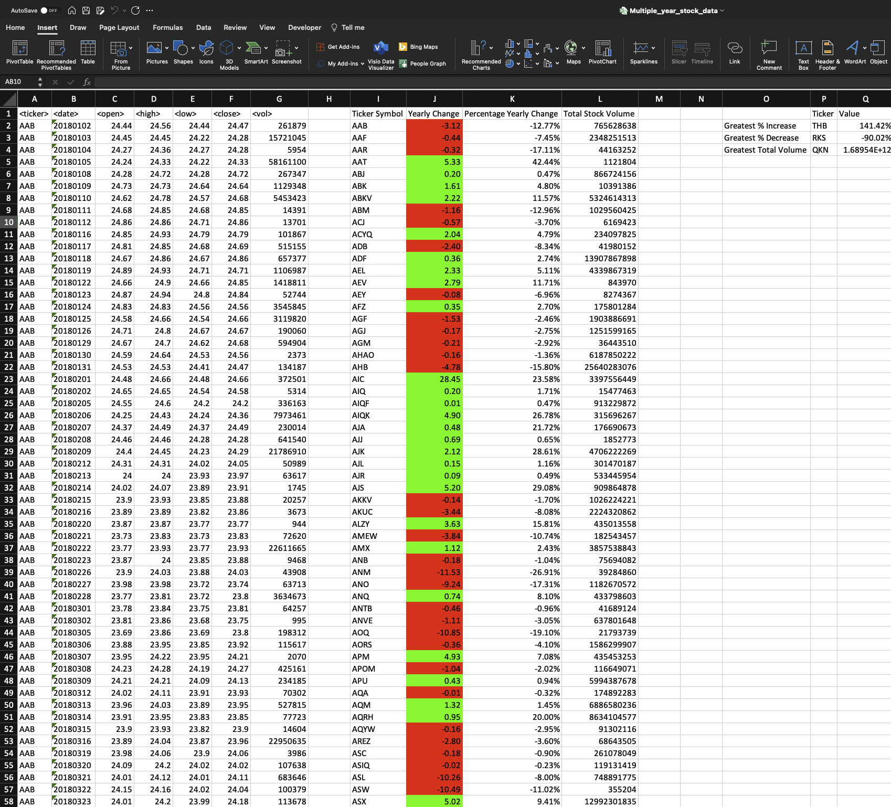
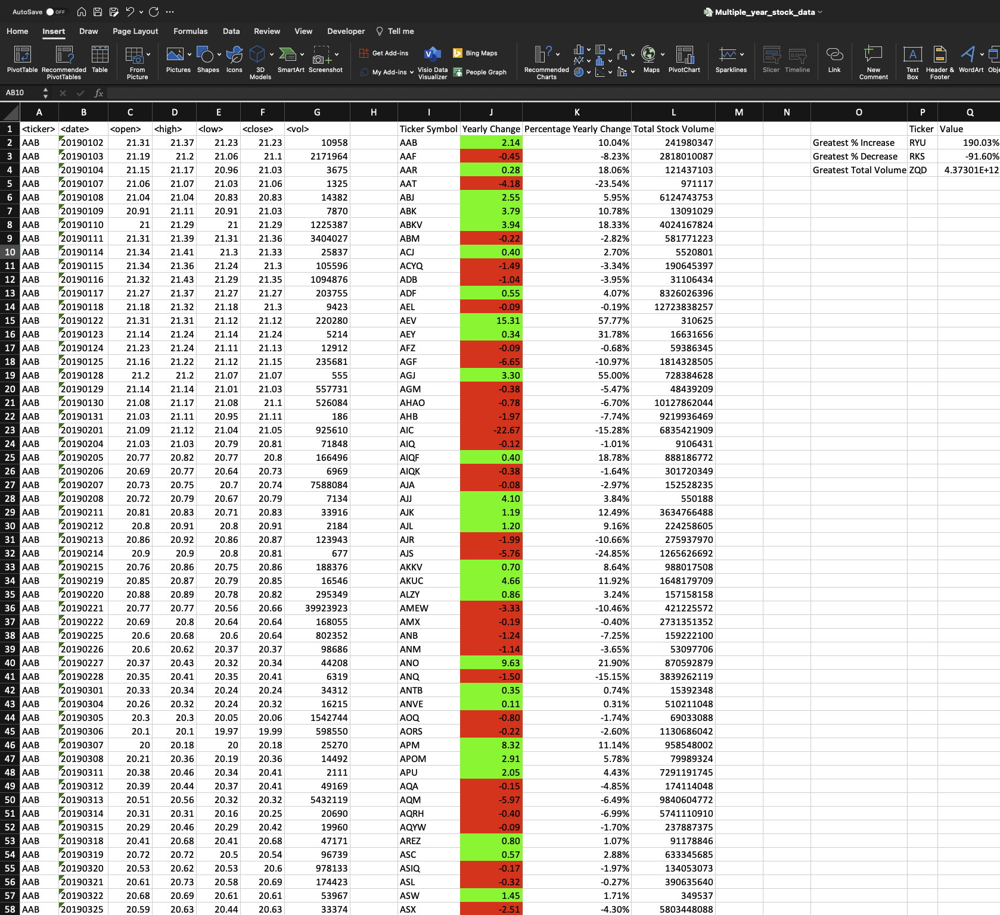
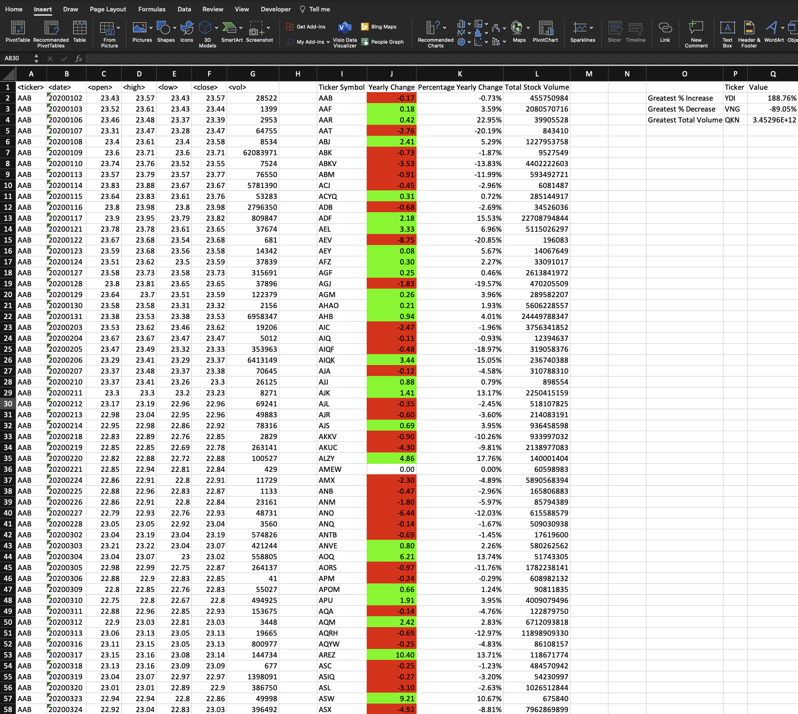

# VBA-challenge
Aim of this challenge was to put forth our VBA scripting skills to the test by analyzing annual stock market data of three years. Data was acquired for the years, 2018 to 2020 spread across three different sheets in the workbook. The challenge was to traverse through multiple columns of each sheet, fetch differing values for Ticker symbol, calculate the yearly change of stock price, calculate percentage change and the total stock volume for each stock. Additionally, we had to create a summary table providing data on the greatest percentage increase and decrease in the stock and the greatest total stock volume for each year.

## How to Install and Run the script 
1. Ensure folders _Images_, _Resources_, excel file _**Multiple_year_stock_data.xlsm**_ and the _Multiple_year_stock_data_sol.vbs_ files are present 
2. Clone the Git repo into your local machine 
3. Ensure you have Excel with VBA scripting enabled 
4. Open _**Multiple_year_stock_data.xlsm**_ with Excel, select Developer and Visual Basic
5. Ensure the output is not present in the excel workbook
6. Open the module, check the script, run the macro named stock_analysis and verify the results 
7. Additionally, there is a sample data file _alphabetical_testing_moderate.xlsm_ in the _Resources_ folder to experiment with and get your desired results

## Credits

In order to solve this challenge, I went over all the class videos and re-did the class activities. Class 3 activities helped me understand how to loop through all the sheets in a workbook. Activity, credit card checker gave me an idea on traversing through a column and finding the different values in it. This helped me understand how to get the ticker symbol and the total stock volume. Additionally, through the youtube link, I could discover new methods such as Select Case for conditional formatting and WorkSheetFunctions such as max, min and match to get the summary table values and the respective rows. I also worked with my TA is ensure the code was right and all the values printed were correct. I did get a glance as the solution only to format my yearly change column to "0.00" format, which I learnt could be done using NumberFormat method in VBA (I used Round function in VBA, but it didn't work as expected)

## References

https://learn.microsoft.com/en-us/dotnet/visual-basic/language-reference/data-types/single-data-type

https://learn.microsoft.com/en-us/office/vba/api/excel.range.autofit#syntax

http://dmcritchie.mvps.org/excel/colors.htm

https://support.microsoft.com/en-us/topic/macro-to-loop-through-all-worksheets-in-a-workbook-feef14e3-97cf-00e2-538b-5da40186e2b0

https://learn.microsoft.com/en-us/office/vba/language/reference/user-interface-help/select-case-statement

https://learn.microsoft.com/en-us/office/vba/api/excel.worksheetfunction.match

https://www.youtube.com/watch?v=ZInAsziSb8o&ab_channel=TheBootCamp

https://www.homeandlearn.org/excel_vba_practice1.html

https://learn.microsoft.com/en-us/office/vba/library-reference/concepts/getting-started-with-vba-in-office

